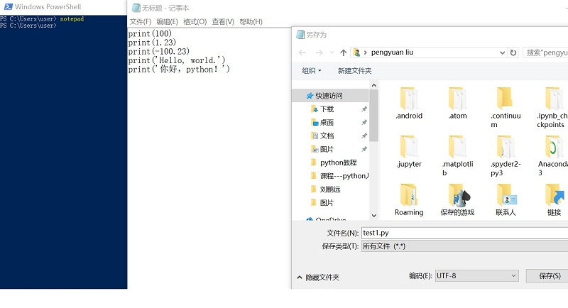
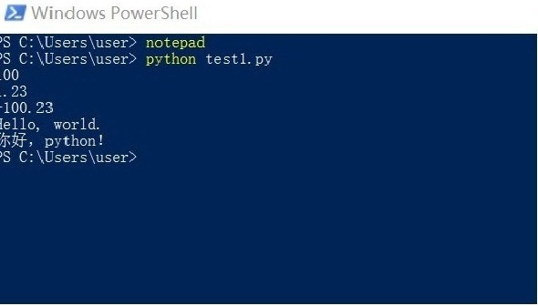

# 第一部分 基础任务篇
<font size=5>
1. 在电脑屏幕显示任意数字与字符  
    1.1 任务分析  
    打开一个文本编辑器如记事本，WPS，Word等，在里面敲入数字与字符，电脑屏幕均会显示，但本书所有任务均是需要编程写代码，通过执行程序来得到结果的。我们需要用计算机能够懂的语言，给计算机下命令，告诉计算机做什么事儿，这个语言本书选用python语言。python语言每条命令一般仅有一个词（事实上大多数语言均如此），比如命令计算机**打印**、**蜂鸣**、**退出**等，每条命令能够完成的事情一般都比较简单，但是指令多了，也会完成非常复杂的事情。  
    1.2 交互模式编程  
    按下`Win+R`键，键入`powershell`并回车，进入shell命令行模式。在命令行中键入`python`并回车，看到类似如下情况，即表明已经进入python语言环境。其中`>>>`是python的命令提示符，该行处闪烁的光标表明该行输入的当前位置。  
      
    在`>>>`后面输入`print(100)`并回车，会发现在下一行显示了100。 
    继续在`>>>`后面输入`print(1.23)`并回车。  
    继续在`>>>`后面输入`print(-100.23)`并回车。  
    继续在`>>>`后面输入`print('Hello, world.')`并回车。  
    继续在`>>>`后面输入`print('你好，python！')`并回车。  
    注意，以上几行代码中的`()`及`'`均为半角字符。  
      
    不难发现，键入代码与该代码执行结果的反馈是交互进行的，因此称为交互模式编程。  
    1.3 脚本模式编程  
    按下`Win+R`键，键入`powershell`并回车，进入shell命令行模式。在命令行中键入`notepad`并回车即可打开记事本，在记事本里面键入上述5行代码，然后将该文件保存。保存时，先选择保存类型为：**所有文件**，编码为：**UTF-8**，文件取名改为test1.py后，点击保存。文件名中的`py`是python源程序的扩展名。  
      
    回到powershell程序界面，键入`python test1.py`并回车，意思是告诉python，运行`test1.py`这个文件。  
      
    程序运行的结果没有出乎我们的预料，在程序文件中有多个指令，则python将这些指令从上到下依次执行。特别的，由于文件已经保存，因此以后还可以重复执行，或者对其加以修改。这种编程方式称之为脚本模式编程。  
    1.4 使用jupyter notebook进行编程  
    以后再写（含有notebook基本使用）  
    1.5 概念解释  
    
    语句、print函数、数字与字符串（表格）  
    1.6 完整代码  
    ``` python
print(100)
print(1.23)
print(-100.23)
print('Hello, world.')
print('你好，python！')
    ```  
    1.7 扩展阅读  
    - 脚本编程模式下的IDE，即集成开发环境，林林总总，其中功能强大且免费的首推Pycharm，也可以直接用Anaconda自带的Spyer，这两种IDE的使用，网上有详细教程，附录2中介绍了其基本功能。  
    - 如果喜欢纯文本模式编程，则推荐vim与editplus，网上有详细教程。  

2. 啊啊啊啊
</font>